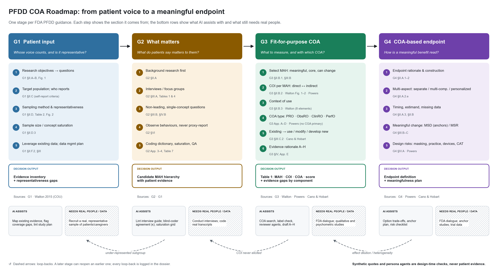

# pfdd-coa-roadmap

A Claude Code plugin that walks a project through the four FDA Patient-Focused Drug Development
guidances to decide **what to measure and how**:

**MAH → COI → fit-for-purpose COA → COA-based endpoint**

| Stage | Guidance | Decides |
|---|---|---|
| G1 · Patient input | PFDD Guidance 1 | Whose voice counts; who reports; sampling; representativeness gaps |
| G2 · What matters | PFDD Guidance 2 | Candidate meaningful aspects of health (MAHs) from patient input |
| G3 · Fit-for-purpose COA | PFDD Guidance 3 · Walton 2015 · Powers 2017 · Cano & Hobart 2011 | MAH selection, COI, context of use, COA type, use/modify/develop, A–H rationale, Table 1 |
| G4 · COA-based endpoint | PFDD Guidance 4 (draft) | Endpoint construction, multi-aspect strategy, meaningful-change plan, design risks |



## Install
```bash
claude plugin marketplace add ~/Desktop/PFDD/plugin
claude plugin install pfdd-coa-roadmap@pfdd-local
# after editing the source:
claude plugin update pfdd-coa-roadmap@pfdd-local
```

## Use
In any project folder: `/pfdd-coa-roadmap:roadmap` (or just describe the task, e.g. "help me choose
the COA for itch in atopic dermatitis"). The workflow:

- shows the workflow figure first, so you see what's behind each step;
- keeps `pfdd-state.json` in your folder and renders `pfdd-dossier.html` after each decision;
- **pauses and asks you** at intake, at each decision point, when real data are needed, and at the end
  of every stage (approve / revise / loop back / pause) — no stage starts until the previous one is
  approved;
- can make an **unattended draft** if you ask for one: every decision is marked *proposed*, and the
  questions you still need to answer are listed at the end.

Persona and reviewer agents (patient-voice, caregiver-observer, clinical-expert, fda-coa-reviewer,
psychometrician, biostatistician, blind-coder) are design-time checks. Their output is labelled
synthetic and never counts as patient evidence.

## Layout
```
pfdd-coa-roadmap/                 (full reference: pfdd-coa-roadmap/README.md)
  skills/roadmap            orchestrator: gates, state, routing   (+ references: state schema, sources, example)
  skills/g1-patient-input   G1                                    (+ references)
  skills/g2-what-matters    G2                                    (+ references)
  skills/g3-fit-for-purpose-coa  G3                               (+ references)
  skills/g4-coa-endpoint    G4                                    (+ references)
  agents/                   7 reviewer / persona agents
  scripts/                  lint_questions.py · saturation.py · agreement.py · render_dossier.py (stdlib only)
  scripts/tests/            unit tests: python3 -m unittest discover -s scripts/tests
  assets/                   workflow.png (+ src/make_workflow_figure.py)
  evals/                    ad-itch, dmd-ambulation: claude plugin eval .
```

Sources: FDA PFDD Guidances 1–4 (public domain); Walton et al. 2015, Powers et al. 2017 (Value in
Health); Cano & Hobart 2011 (Patient Preference and Adherence) are cited and paraphrased, not bundled.
The plugin prepares for FDA dialogue; it does not replace it.
